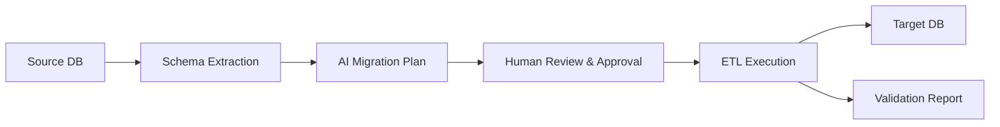

# 🚀 QueryVista — AI-Powered Database Migration Platform

> **Migrate data between any databases with AI-generated schema mapping and human-in-the-loop approval.**

QueryVista is a comprehensive ETL (Extract, Transform, Load) platform that enables migrating data between different database systems — SQL to NoSQL, NoSQL to SQL, or any combination. The platform uses **Azure OpenAI GPT-4o** to intelligently draft migration schemas, provides a **human-in-the-loop review** process, and executes migrations with full validation.

---

## 📋 Table of Contents

- [Relevance](#relevance)
- [Architecture Overview](#architecture-overview)
- [Supported Migration Pipelines](#supported-migration-pipelines)
- [Tech Stack](#tech-stack)
- [Project Structure](#project-structure)
- [Setup & Installation](#setup--installation)
- [API Endpoints](#api-endpoints)
- [User Journey](#user-journey)
- [Testing](#testing)
- [Security Notes & Known Limitations](#security-notes--known-limitations)
- [Roadmap](#roadmap)

---

## Relevance

This project applies engineering fundamentals to a genuinely hard data-systems problem — moving structured and semi-structured data safely between very different database paradigms:

- **Object-Oriented Design** — a shared `base.py` pipeline class in `backend/pipelines/` standardizes the extract → plan → review → execute → validate flow across all 8 source/target combinations.
- **Data Structures & Multi-DB Systems** — handles relational (MySQL, PostgreSQL) and document/NoSQL (MongoDB, CouchDB) schemas side by side: type mapping, nested-object flattening, JSON/JSONB handling, `_rev` conflict resolution, and ObjectId conversion.
- **Generative AI APIs** — Azure OpenAI GPT-4o is used for structured schema-mapping generation, with a human-in-the-loop review/edit step before anything executes against real data — a safety-conscious pattern, not a fire-and-forget agent.
- **Validation & Testing Mindset** — the architecture includes an explicit validation phase (source vs. target query comparison) as a first-class pipeline step, not an afterthought.
- **Web Application Development** — FastAPI backend with a documented REST API contract, plus a lightweight HTML/CSS/JS frontend for driving the migration workflow end to end.

---

## 🏗️ Architecture Overview

Every migration pipeline follows a **4-phase architecture**:

```
Phase 1: DISCOVERY      → Extract schema/metadata from source DB
Phase 2: AI ARCHITECT   → Azure GPT-4o drafts migration plan (JSON blueprint)
Phase 3: HUMAN REVIEW   → User reviews, edits, and approves the plan
Phase 4: EXECUTION      → ETL engine migrates data with validation
```



---

## 🔄 Supported Migration Pipelines

| # | Pipeline Name | Source DB | Target DB | Notebook/Script |
|---|--------------|-----------|-----------|-----------------|
| 1 | `mysql_to_couchdb` | MySQL | Apache CouchDB | `all_pipelinee/mysql_to_couchdb_pipeline.ipynb` |
| 2 | `postgres_to_couchdb` | PostgreSQL (Neon) | Apache CouchDB | `all_pipelinee/postgres_to_couchdb_pipeline.ipynb` |
| 3 | `mysql_to_mongo` | MySQL | MongoDB Atlas | `all_pipelinee/mysql_to_mongo.ipynb` |
| 4 | `postgres_to_mongo` | PostgreSQL (Neon) | MongoDB Atlas | `all_pipelinee/Query_vista.ipynb` / `query_vista_postgrestomongo.py` |
| 5 | `couchdb_to_mysql` | Apache CouchDB | MySQL | `all_pipelinee/CouchDB-MySQL.ipynb` |
| 6 | `couchdb_to_postgres` | Apache CouchDB | PostgreSQL | `all_pipelinee/CouchDB-PostgreSQL.ipynb` |
| 7 | `mongo_to_mysql` | MongoDB Atlas | MySQL | `all_pipelinee/Mongo-Sql.ipynb` |
| 8 | `mongo_to_couchdb` | MongoDB Atlas | Apache CouchDB | `all_pipelinee/Mongodb-Couchdb.ipynb` |

Each pipeline supports three migration modes where applicable: `REPLACE`, `APPEND`, `UPSERT`.

Notable per-pipeline handling:
- **CouchDB ↔ MySQL** — automatic MySQL version detection, JSON column support, VARCHAR safety guardrails.
- **CouchDB ↔ PostgreSQL** — JSONB support, BYTEA for binary data, TIMESTAMP mapping, `ON CONFLICT` upsert.
- **MongoDB ↔ MySQL** — ObjectId → string conversion, nested-object flattening, JSON column auto-detection.
- **MongoDB ↔ CouchDB** — REST API bulk inserts, `_rev` handling for upserts, `doc_type` tagging.

---

## 🛠️ Tech Stack

| Layer | Technology |
|-------|-----------|
| **AI Engine** | Azure OpenAI GPT-4o |
| **Backend** | FastAPI (Python) |
| **Frontend** | HTML5, CSS3, JavaScript |
| **Source DBs** | MySQL, PostgreSQL (Neon), MongoDB Atlas, Apache CouchDB |
| **Target DBs** | MySQL, PostgreSQL, MongoDB Atlas, Apache CouchDB |
| **ORM** | SQLAlchemy |
| **DB Drivers** | pymysql, psycopg2, pymongo, couchdb (python-couchdb) |
| **Containerization** | Docker Compose (MySQL + CouchDB + phpMyAdmin) |
| **Deployment** | Render (see `render.yaml`) |

---

## 📁 Project Structure

```
MINI_PROJECT/
├── .env.example                  # Template — copy to .env, fill in real values
├── .gitignore
├── README.md
├── API_CONTRACT.md               # Full API request/response contract
├── PROJECT_OVERVIEW.md
├── docker-compose.yml            # MySQL + CouchDB + phpMyAdmin containers
├── render.yaml                   # Render deployment config
├── cli.py                        # Command-line entry point
│
├── all_pipelinee/                # Migration pipeline notebooks & scripts
├── initial_migration/
├── mysql_couch/                  # Docker setup for MySQL ↔ CouchDB
├── postgres_couch/               # Postgres ↔ CouchDB pipeline assets
├── sql/                          # SQL schema/setup scripts
│
├── backend/                      # FastAPI backend
│   ├── main.py                   # FastAPI application
│   ├── pipelines/
│   │   ├── base.py               # Shared base pipeline class
│   │   ├── mysql_to_mongo.py
│   │   ├── mysql_to_couchdb.py
│   │   ├── postgres_to_mongo.py
│   │   ├── postgres_to_couchdb.py
│   │   ├── mongo_to_mysql.py
│   │   ├── mongo_to_couchdb.py
│   │   ├── couchdb_to_mysql.py
│   │   └── couchdb_to_postgres.py
│   └── requirements.txt
│
├── frontend/
│   ├── index.html
│   ├── style.css
│   └── app.js
│
└── SQLAI/                        # Related sub-project (see its own README)
```

---

## ⚡ Setup & Installation

### Prerequisites
- Python 3.10+
- Docker & Docker Compose (for local MySQL + CouchDB)
- MongoDB Atlas account (cloud)
- PostgreSQL / Neon account (cloud)
- Azure OpenAI API key

### 1. Clone & install dependencies
```bash
git clone https://github.com/dhawalevitthal7/MINI_PROJECT.git
cd MINI_PROJECT
python -m venv venv
venv\Scripts\activate        # Windows
pip install -r backend/requirements.txt
```

### 2. Start Docker services
```bash
cd mysql_couch
docker-compose up -d
```
This starts:
- **MySQL** on port `3310`
- **CouchDB** on port `5984` (Fauxton UI: http://localhost:5984/_utils)
- **phpMyAdmin** on port `8081`

### 3. Configure environment variables
```bash
cp .env.example .env
```
Fill in `.env` with your own values — **never commit real credentials**:
```env
# MySQL
MYSQL_URL=mysql+pymysql://<user>:<password>@localhost:3310/<database>

# PostgreSQL (Neon or any Postgres)
DATABASE_URL=postgresql+psycopg2://<user>:<password>@<host>:5432/<database>

# CouchDB
COUCHDB_URL=http://<user>:<password>@localhost:5984

# MongoDB Atlas
MONGO_URL=mongodb+srv://<user>:<password>@<cluster>.mongodb.net/

# Azure OpenAI
AZURE_ENDPOINT=https://<your-resource>.openai.azure.com/
AZURE_API_KEY=<your_azure_api_key>
AZURE_API_VERSION=2024-12-01-preview
AZURE_DEPLOYMENT_NAME=gpt-4o
```

### 4. Run the backend
```bash
cd backend
uvicorn main:app --reload --port 8000
```

### 5. Open the frontend
```bash
cd frontend
python -m http.server 3000
```

---

## 🌐 API Endpoints

### Base URL: `http://localhost:8000`

| Method | Endpoint | Description |
|--------|----------|-------------|
| `GET` | `/` | Health check |
| `GET` | `/api/pipelines` | List all available migration pipelines |
| `GET` | `/api/databases` | List all supported database types |
| `POST` | `/api/test-connection` | Test connection to a database |
| `POST` | `/api/extract-schema` | Extract schema/metadata from source DB |
| `POST` | `/api/generate-plan` | AI generates migration plan from schema |
| `POST` | `/api/update-plan` | Send feedback to AI, update migration plan |
| `POST` | `/api/approve-plan` | Approve the migration plan |
| `POST` | `/api/execute-migration` | Execute the approved migration |
| `GET` | `/api/migration-status/{id}` | Get migration progress/status |
| `GET` | `/api/migration-history` | List past migrations |

Full request/response schemas are documented in [`API_CONTRACT.md`](./API_CONTRACT.md).

### Example: Test connection
```bash
curl -X POST http://localhost:8000/api/test-connection \
  -H "Content-Type: application/json" \
  -d '{
    "db_type": "mysql",
    "host": "localhost",
    "port": 3310,
    "user": "<user>",
    "password": "<password>",
    "database": "<database>"
  }'
```

### Example: Generate migration plan
```bash
curl -X POST http://localhost:8000/api/generate-plan \
  -H "Content-Type: application/json" \
  -d '{
    "source_type": "mysql",
    "target_type": "mongodb",
    "schema_text": "<schema extracted from previous step>"
  }'
```

---

## 🎯 User Journey

1. **Select Source & Target** — pick which database to migrate FROM and TO.
2. **Connect** — enter credentials, test connection.
3. **Extract Schema** — system reads the source DB schema.
4. **AI Plans Migration** — GPT-4o generates a JSON migration blueprint.
5. **Human Reviews** — user can modify field mappings, embeddings, drops before anything runs.
6. **Approve & Execute** — migration runs with progress tracking.
7. **Validate** — side-by-side query comparison of source vs. target confirms the migration.

---

## Testing

No automated test suite currently exists beyond manual notebook runs per pipeline. Suggested next steps, particularly relevant for a QA/test-development context:

- Unit tests per `backend/pipelines/*.py` module — type-mapping correctness (e.g. ObjectId → string, JSONB round-trips) using small fixture datasets, not live cloud databases.
- Contract tests against `API_CONTRACT.md` to catch backend/frontend drift.
- A dry-run/validation-only mode that runs Phase 1 (Discovery) + Phase 2 (AI Plan) without ever touching Phase 4 (Execution) — useful both as a safe test harness and as a user-facing "preview" feature.
- Regression tests for the `REPLACE` / `APPEND` / `UPSERT` modes against edge cases (duplicate keys, schema drift between runs).

---

## Security Notes & Known Limitations

- **Never commit real credentials.** Earlier versions of this README included plaintext database passwords and connection strings for local/dev services — these have been removed and replaced with `.env` placeholders. If any of those values were ever reused for real cloud resources (MongoDB Atlas, Neon, Azure), rotate them.
- **No connection-string sanitization documented** for logs/error messages — worth confirming the backend doesn't leak full connection URLs (including credentials) in error responses or logs.
- **No authentication on the API** — `backend/main.py` endpoints appear open; fine for local/demo use, not for a shared deployment as-is.
- **AI-generated migration plans are not validated against a schema/type system before human review** — worth adding a validation pass so obviously malformed plans (e.g. type mismatches) are caught before a human has to catch them manually.
- **Docker default credentials** (`docker-compose.yml`) are fine for local development but should never be the values used in any shared or deployed environment.

---

## Roadmap

- [ ] Automated test suite (unit + contract tests, dry-run validation mode)
- [ ] API authentication / API-key middleware
- [ ] Connection-string redaction in logs and error responses
- [ ] Schema/type validation pass on AI-generated plans before human review
- [ ] Migration rollback support

---

## 📝 License

This project is for educational and portfolio purposes.

---

Built with ❤️ by the QueryVista team.
